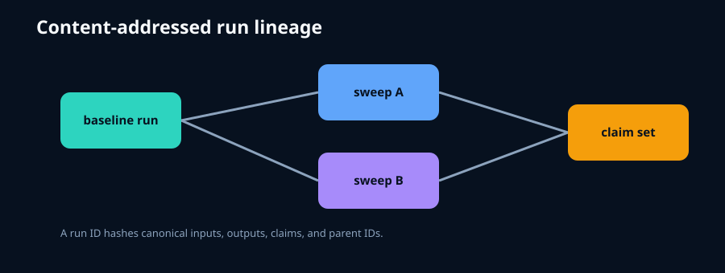

# scientific-run-registry



A small, dependency-free registry that gives a computational run a stable identifier derived
from canonical inputs, outputs, claims, and parent runs. It makes stale or modified records
detectable without imposing a database.

```python
from run_registry import Registry
run=Registry("runs.json").register({"x":1},{"y":2},["C1"])
```

Run `python tools/generate_figure.py` and `python -m unittest discover -s tests -v`. The repository is a reusable primitive,
while [VOLLEY](https://github.com/aaaaaaaaaaaavm/VOLLEY) remains the flagship application.
